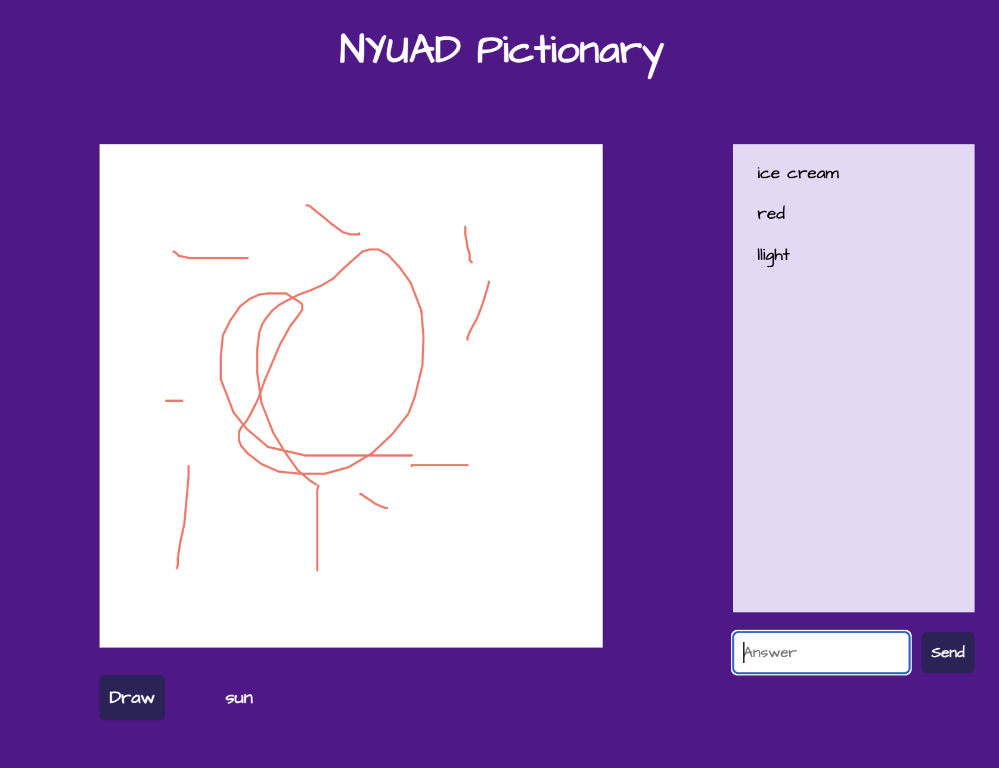
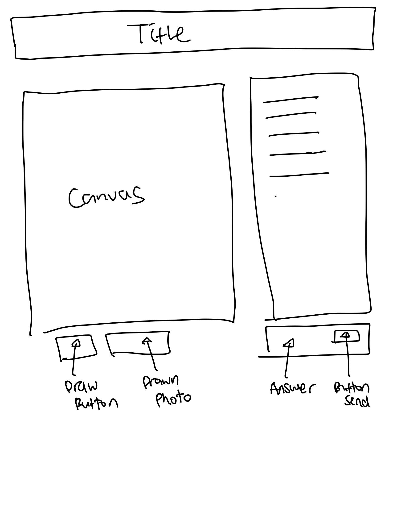
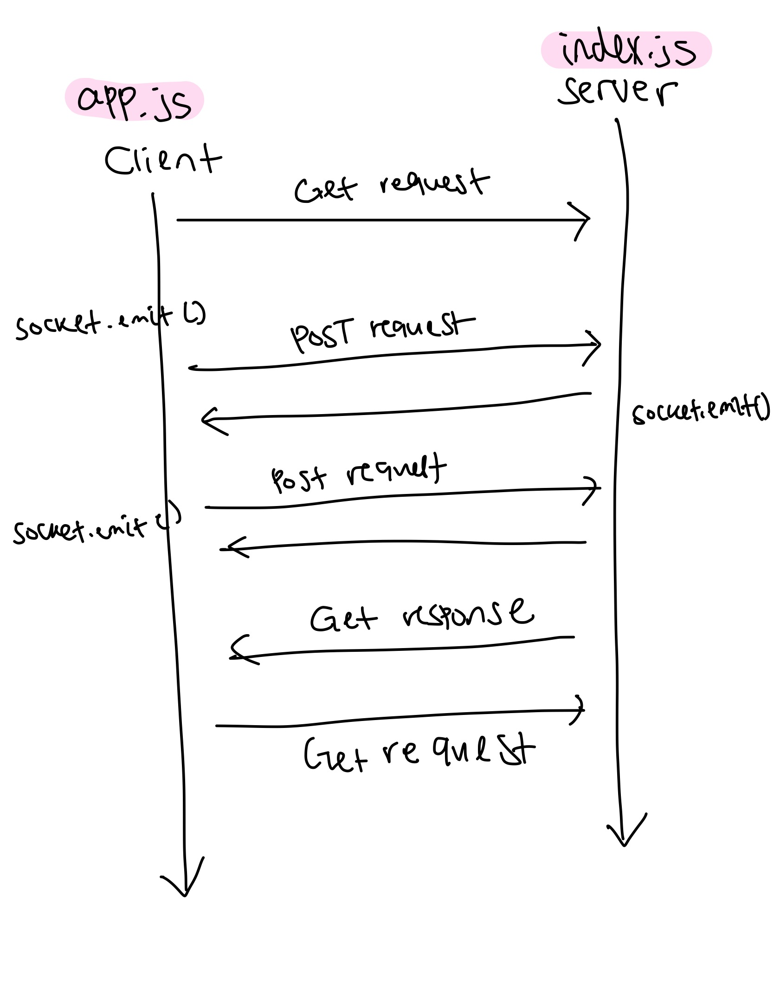
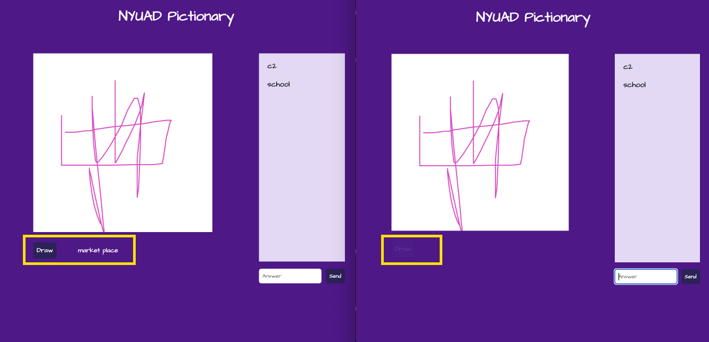
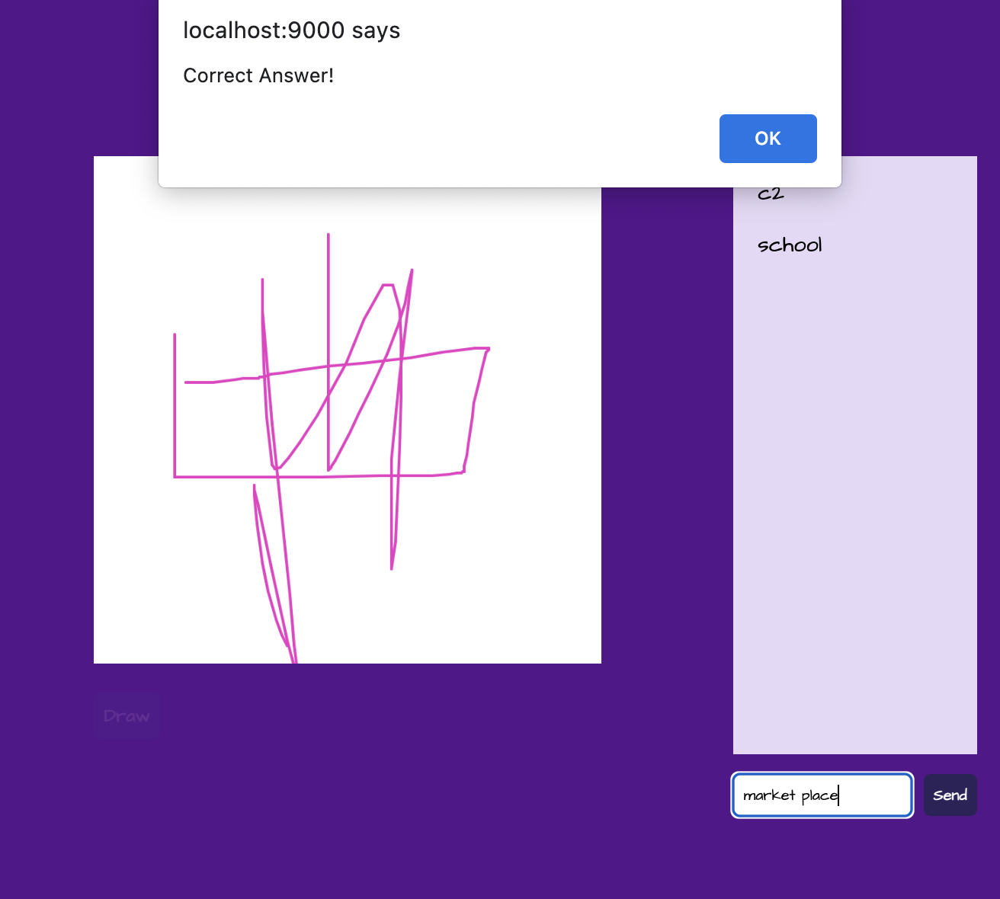

# NYUAD Pictionary

**Title**:NYUAD Pictionary <br>
**Category**: WEEK 8 <br>
**Date**: 25 Mar 2022 <br>
**Deliverable**: CSS/HTML/Javascript/Node.js/Client-server Connected Game <br>

[Access Project Here](https://foregoing-shrub-tail.glitch.me)



## Project Overview
Using Node-Express and incorporating socket.io, I created NYUAD Pictionary Game. Pictionary is a fun drawing game where one person draws and other players try to guess what is being drawn. For this game, I created the JSON file with the words associated with NYUAD to draw words from there.


## WireFrame

This project has two sections: canvas where the players can draw, and the chat section where the players can make guesses. 


## WORKFLOW


For this project, understanding how client and server communicates, and following steps without missing a step was important. First step is the handshake part. For example, to make player's drawing sync to all clients, the data first need to be sent to the server from the client


**From Client -> Server**

```
    //emit htis information to the server
    socket.emit('mousePositionData',mousePos);

```


The server listens from a client, then send to all clients

**From Server -> All Clientsr**


```
//listen for a message from a client
    socket.on('mousePositionData',(data)=>{
        console.log(data);
        io.sockets.emit('mouseDataFromServer', data);
    })


```


Here, depending on the purpose, the data can be sent to all clients, others not including the cleint, or send the response to this client

```

        //Send a response to all clients, including this one
        io.sockets.emit('mouseDataFromServer', data);

        //Send a response to all other clients, not including this one
        socket.broadcast.emit('mouseDataFromServer', data);

        //Send a response to just this client
        socket.emit('mouseDataFromServer', data);
        
```

This data is then picked up by the client, and used to draw on the canvas 

```

 socket.on('mouseDataFromServer', (data)=>{
        drawWithData(data);
    })

```


Understanding these steps at first was confusing but once I wrote down the steps, I was able to understand how server and client communicates and be able to apply with more functions. 


## Allow one person to draw & Diable Button


When players connect to ther server, everyone has access to draw the word until one person draws the word. Once the word is drawn by one player, drawing word function is disabled to reset of the clients. A person who draws the word can start drawing, or redraw the word if needed. 

On CSS you can customize disabled button as such:

```
#getword-button:disabled,
#getword-button[disabled]{
    background-color:#424384;
    opacity:0.1;

}
```


## All clients notified correct and move on to next

When a client answers the drawing correctly, everyone will be notified and the game moves to the next round. Again, any player can draw the word by clicking "Draw" button. 


## When Correct Answer, Inform


When a player guesses the correct, answer, every player is notified, and the game moves to the next round. Same as how it started, everyone has access to receive the word and the first person to receive the word will be the next player to draw.

## Reflection & What's Next

I am so proud of this project because pictionary is one of my favorite online game that kept me sane during quarantine. How to implementation all the feature was daunting at first. My strategy was to make MVP and elaborate. In the end, I was able to build a playable pictionary game with NYUAD theme. 

Here are some of the improvements I want to make moving forward. 

1) I want to improve this project by adding more words for word.json file. For now, I have only added a few, but I plan to make more.

2) Improve on drawing function. For now, the player can only draw with a default brush stroke and black color. By adding customizable colors, brush stroke feature, players will be able to illustrate better. Erasor function will be added as well.

3) Client points system. For now, when a client guess the correct word, they get an alert and move on to the next round. I plan to implement the scoreboard where the multiplayers can compete with each other and ear points. 

